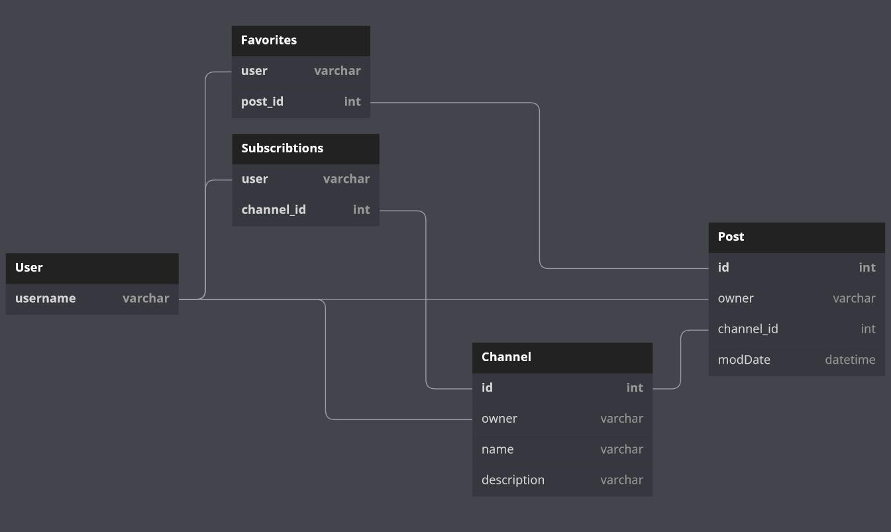
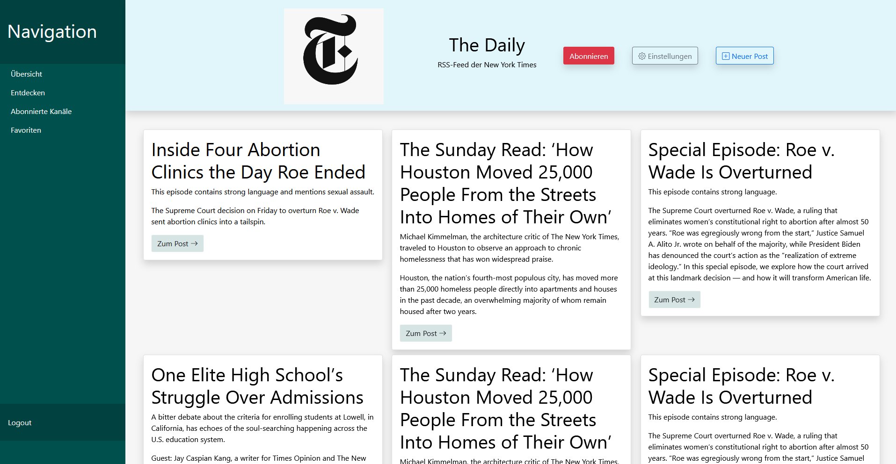

# Dokumentation Firmenprojekt im SRZ: Intectainment - communication is key


- **Schüler:** Bruno Hoffmann, Karl Jahn, Tom Nitsche & Jakob Paridon
- **Kurs:** [Informatik III/IV 4 SRZ](https://tu-dresden.de/ing/informatik/srz)
- **Firma:** [intecsoft group](https://www.intecsoft.de/)
- **Firmenbetreuer:** Claus Jungmann, Eugen Gorning
- **AG-Leiter:** Tassilo Tanneberger


## Ziel des Projektes
Intectainment ist ein Infotainment-System, das, ähnlich zu anderen sozialen Netzwerken, Kommunikation und das Veröffentlichen von Inhalten ermöglicht. 
Dazu kann jeder Nutzer einen Kanal (ggf. mit Beschreibung) erstellen, auf dem er Informationen herausgibt. Diese Kanäle können von anderen Usern abonniert werden, welche sich die entsprechenden Zusammenhänge auf ihren Startseiten anzeigen lassen können.
Jede Startseite besteht aus einzelnen Kacheln, welche Posts abonnierter Kanäle anzeigen; somit ist auch jede Startseite individuell und für den entsprechenden Nutzer angepasst.
Alle Posts eines jeden Kanals sind ähnlich strukturiert: mithilfe der [Markdown-Syntax](https://www.markdownguide.org/basic-syntax) lassen sich einfache und übersichtliche Texte schreiben, in denen sich auch Formatierungen, Links, Bilder usw. einbinden lassen.
Weitere Funktionen umfassen das Merken und spätere Abrufen von Posts sowie das Redigieren (insb. durch Löschen) von Posts durch eine Redaktion.
Intectainment soll den Austausch zwischen Mitarbeitern in einer Firma unterstützen und verbessern.

## Deployment
### Anforderungen
Intectainment benötigt eine `SQL-Datenbankanbindung`, eine Python Runtime (getestet auf `Python 3.10`) sowie einen `LDAP-Server` zur Nutzerauthentifizierung.

### Lokales Aufsetzten für Development
1. Installieren der Python-Bibliotheken
```
pip install -r requirements-dev.txt
```
2. Setzen der Umgebungsvariablen (siehe [Konfiguration](#konfiguration))

3. Zum starten folgenden Befehl ausführen:
   - beim erstmaligen Ausführen wird die Datenbank aufgesetzt
```
python run.py
```

Für ein richtiges Deployment sollte nicht der flaskinterne Webserver, sondern das Webserverinterface [uWSGI](https://flask.palletsprojects.com/en/2.0.x/deploying/uwsgi/) verwendet werden. Eine Beispielimplementation mit [NGINX](https://www.nginx.com/) ist auch in der [Production Dockerfile](Dockerfile.prod) einzusehen.


### Aufsetzen per Docker
```
docker build -f "Dockerfile.prod" -t intectainment:latest .
docker run -p 80:80 --env INTECTAINMENT_LDAP_SERVER=ldap://localhost -d intectainment
```
Für die volle Liste von env-Parametern siehe auch [Konfiguration](#konfiguration).
Um Posts und Bilder dauerhaft zu speichern muss der Pfad `/Intectainment/Intectainment/content` als [Volume](https://docs.docker.com/storage/volumes/) festgelegt werden.


### Aufsetzen mit docker-compose
In der Standardeinstellung wird ein Intectainment-Server sowohl als auch ein LDAP-Server mit Admin-Panel aufgesetzt.
Um die Installation anzupassen müssen einfach die Enstellungen in der [docker compose](docker-compose.yaml)-Datei bearbeitet werden.
```
docker-compose up
```

## Konfiguration
Die Einstellungen können sowohl durch systemweite Umgebungsvariablen als auch in der [.env](.env)-Datei festgelegt werden. Existiert eine systemweite Umgebungsvariable so überschreibt diese den Wert welcher in der .env-Datei festgelegt wird.


|Name|Beschreibung|Default Wert|
|----|------------|------------|
|INTECTAINMENT_DB_URI|Die Database-URI dient zur Verbindung zur Datenbank. Für Kompatibilität siehe auch [SqlAlchemy-URIs](https://docs.sqlalchemy.org/en/14/core/engines.html)|sqlite:///content/database.db|
|INTECTAINMENT_SECRET|Flask verwendet diesen Wert zur Verschlüsselung von Sessions o.ä. Sollte auf jeden Fall geheim beiben||
|INTECTAINMENT_LDAP_SERVER|URL für den LDAP-Server zur Nutzerauthentifizierung|
|INTECTAINMENT_LDAP_ROOT|Search Base DN für alle Operationen|dc=intecsoft,dc=de|
|INTECTAINMENT_LDAP_USER_DN|Search Path für Nutzer|ou=users|
|INTECTAINMENT_LDAP_GROUP_DN|Search Path für Gruppen|ou=groups|
|INTECTAINMENT_LDAP_USER_ID|Nutzer RDN-Attribut|cn|
|INTECTAINMENT_LDAP_GROUP_ID|Gruppen RDN-Attribut|cn|
|INTECTAINMENT_LDAP_GROUP_OBJ_CLASS|object-class der Gruppen zur Nutzerauthentifizierung|posixGroup|
|INTECTAINMENT_LDAP_GROUP_MEMBER_ATTR|Attribut einer Gruppe welches die zugewiesenen Nutzer beinhaltet|memberUid|
|INTECTAINMENT_LDAP_PERMISSIONS|Ein python dict welches einen LDAP-Gruppen-Namen zu einem Permission-Level mappt|{'user': 10, 'moderator': 100, 'admin': 255}|
|INTECTAINMENT_LDAP_ELEVATED_USER|User-DN welche zur Berechtigungs-Bestimmung benötigt wird||
|INTECTAINMENT_LDAP_ELEVATED_PWD|Passwort für den elevated user||

## Einfügung eines Testdatensatzes
Durch das Ausführen der [Example-Content-Datei](exampleDbContent.py) werden einige Beispieldatensätze eingefügt die zur Demonstration des Projektes verwendet werden können.

## Umsetzung
### Libraries und Frameworks
Die Backend-Verwaltung wird mithilfe des Frameworks [Flask](https://flask.palletsprojects.com/en/2.0.x/) und dessen Erweiterung [Flask-SQLAlchemy](https://flask-sqlalchemy.palletsprojects.com/en/2.x/) gestaltet. 
Flask ermöglicht das dynamische Erstellen von Websites und das Abrufen/Eintragen von Informationen aus bzw. in einer Datenbank mit Nutzung von Python-Code. 
Wir haben uns für die Nutzung des Frameworks entschieden, da es das Anzeigen von gleichförmigen, aber unterschiedlichen Daten (also z. B. Posts, Kanäle und Dashboards, welche alle der gleichen Struktur folgen, jedoch trotzdem verschiedene Eigenschaften haben) deutlich vereinfacht.

Zur Nutzerauthentifizierung und Berechtigungsbestimmung verwenden wir LDAP. 

Das Frontend basiert hauptsächlich auf dem Framework [Bootstrap 5](https://getbootstrap.com/docs/5.0/getting-started/introduction/).

Die live-Übersetzung von Markdown in HTML wurde mit dem Converter [Showdown](http://showdownjs.com/) umgesetzt. 
### Datenbankarchitektur
Die wichtigsten Daten von Intectainment, welche die Grundlage für das System bilden, sind unten dargestellt.

*Abb. 1: Vereinfachtes Datenbankmodell von Intectainment*

Alle essentiellen Funktionen - Nutzerprofile, Kanäle und Posts sowie deren Erweiterungen (namentlich Abonnements, Kategorien und das Merken von Veröffentlichungen) - werden so wie hier dargestellt realisiert.
Die Darstellung umfasst jedoch nur die Grundlagen des Backend-Systems und besitzt somit keinen Anspruch auf Vollständigkeit.

### Wichtige Abläufe
#### Erstellen von Kanälen

Jeder Nutzer kann Kanäle erstellen, die gemeinschaftlich von allen Mitarbeitern des Unternehmens genutzt und betrieben werden. Den Kanälen kann bei ihrer Erstellung eine Kategorie zugewiesen werden (z. B. C++, IoT, Web-Development usw.), die die Suche nach und das Entdecken von Kanälen erleichtert.
Wie bereits erwähnt, werden alle Kanäle nicht von einzelnen Usern, sondern von der gesamten Mitarbeiterschaft betrieben. Das bedeutet, dass jeder angemeldete Nutzer auf einem beliebigen Kanal Posts verfassen und veröffentlichen kann. Dies soll dabei helfen, dass jeder Nutzer Texte zu für ihn interessanten Themen verfassen kann und keine Konkurrenz zwischen verschiedenen Kanälen zum gleichen Themea entsteht.

#### Kanalansicht und -navigation


*Abb. 3: Beispielansicht eines Kanals inklusive der neuesten Posts*

Wählt man einen Kanal aus, wird eine Vorschau der aktuellsten Posts angezeigt, welche die ersten Zeilen des Textes umfasst. Über die Schaltfläche "Zum Post" lässt sich der Text in voller Länge aufrufen. Dort kann man diesen auch als Favoriten markieren und ggf. bearbeiten.
Als angemeldeter Nutzer kann man Kanäle abonnieren bzw. deabonnieren, aber auch Posts erstellen und auf dem entsprechenden Kanal veröffentlichen. Ist man der Ersteller des Kanals, kann man auch die Einstellungen (z. B. Beschreibung, Kategorie und Kanalbild) anpassen.

#### Erstellen und Bearbeiten von Posts


*Abb. 4: Beispielansicht eines Posts während der Erstellung*

Nach der Auswahl des Kanals, auf  welchem der entsprechende Post erscheinen soll, kann der Nutzer mithilfe der Markdown-Syntax einen Text verfassen, welcher in Echtzeit zu HTML konvertiert und neben dem Eingabefeld angezeigt wird. 
Für das Hochladen von Bildern gibt es eine eigene Schaltfläche; mit dieser kann man Bilder auf dem genutzten Server hochladen und über einen eigens dafür generierten Link im Text einbinden. Alternativ ist auch das Einbinden ein Bildern aus externen Quellen möglich.
Bei der Veröffentlichung wird der Posts als Markdown-Datei auf dem Server gespeichert. In der Datenbank wird zudem eine Verlinkung zu der Datei eingetragen, welche zusätzliche Informationen wie das Datum der Erstellung, den Kanal und das Datum der letzten Bearbeitung speichert. 
Auch nach der Veröffentlichung kann der User, welcher den Post erstellt hat, diesen in beliebigem Maße bearbeiten bzw. löschen.


#### Redaktion und Moderation
Um die Verwaltung des Systems kümmert sich mit den Administratoren auch eine Redaktion. Diese ist die einzige Instanz, welche - neben dem entsprechenden Nutzer - Posts und Kanäle bearbeiten kann. 
## Erweiterungsmöglichkeiten

Intectainment stellt als soziale Plattform ein Projekt mit vielen verschiedenen **Erweiterungsmöglichkeiten** dar, weswegen im folgenden Abschnitt nur einige, besonders bedeutsame beleuchtet werden können.

### Nutzung auf Displays
Als Sammelpunkt für Informationen über und Geschehnisse im Unternehmen wäre auch die Nutzung von Intectainment auf Bildschirmen (z. B. im Eingangsbereich oder auf den Gängen der jeweiligen Firma) ohne Nutzerinput denkbar. Ein eigens für diese Aufgabe eingerichtetes Dashboard würde die aktuell wichtigsten Informationen bereitstellen. 
Diese Bildschirme könnten für verschiedene Nutzergruppen angepasst werden: während neue Kunden sich einen Überblick über das Unternehmen verschaffen wollen, sind für Entwickler Updates von Projekten oder Änderungen im Zeitplan eher von Bedeutung.
Die Positionierung der Displays im Gebäude wäre dann von der entsprechenden Zielgruppe abhängig.
